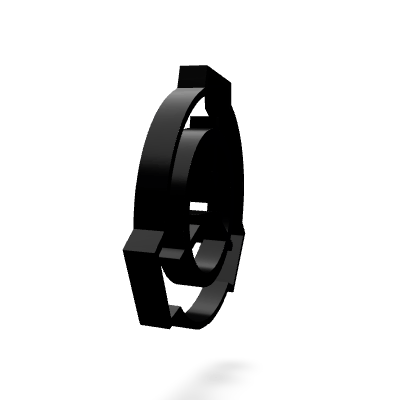

<p align="center">
  
</p>

<h1 align="center">Hey, I'm <b>Koushal</b> 👋</h1>

<p align="center">
  
</p>

<p align="center">
  
  
</p>


## ⚡ About Me

```yaml
name: Koushal
located_in: India
education:
  university: GLA University
  degree: B.Tech CSE (AIML)

fields_of_interest:
  - "Artificial Intelligence"
  - "Machine Learning"
  - "Data Engineering & ETL Pipelines"
  - "Software Development"
  - "WebGPU & 3D Graphics"

currently_learning:
  - "Advanced AI/ML Algorithms"
  - "Cloud Architecture (Azure)"
  - "Modern Web & GPU Computing"

fun_fact: "I turn SVGs into 3D spinning objects for fun 🌀"
```


## 🛠 Tech Stack

<table align="center">
<tr>
<td align="center" width="50%">

### ⌨️ Languages


</td>
<td align="center" width="50%">

### 🧠 AI / ML & Data


</td>
</tr>
<tr>
<td align="center" width="50%">

### ☁️ Cloud & Databases


</td>
<td align="center" width="50%">

### 🔧 Tools & Platforms


</td>
</tr>
</table>


## 🌐 Connect With Me

<p align="center">
  <a href="mailto:your_email@gmail.com">
    
  </a>&nbsp;
  <a href="https://linkedin.com/in/YOUR_LINKEDIN">
    
  </a>&nbsp;
  <a href="https://instagram.com/YOUR_INSTAGRAM">
    
  </a>&nbsp;
  <a href="https://reddit.com/user/YOUR_REDDIT">
    
  </a>
</p>


## 📊 GitHub Stats

<p align="center">
  
  
</p>

<p align="center">
  
</p>


## 🏆 GitHub Trophies

<p align="center">
  
</p>


## ✍️ Dev Quote

<p align="center">
  
</p>

---

<p align="center">
  
</p>
